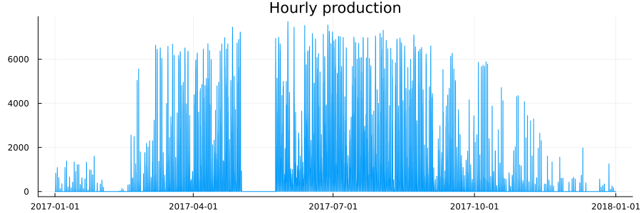
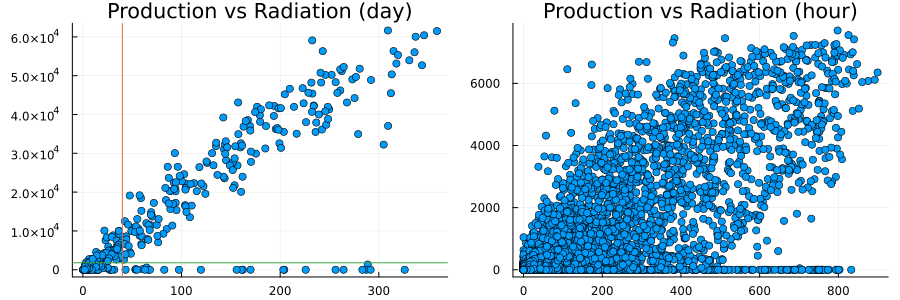

Solar energy forecast
================

## Import libraries

Import libraries for data cleaning, statistics, machine learning and
visualization

``` julia
using Dates, DataFrames, Plots, StatsPlots, Statistics, Distributions
using StatsBase, HypothesisTests, LinearAlgebra, Random, MLJ, CSV, CategoricalArrays 
```

## Dataset

Our data contains information on these key factors:

- **timedate**: date and hour of each datapoint
- **WindSpeed**: wind speed in Km/h
- **Sunshine**: minutes per hours that sun is not cover by clouds
  (scaled 0-60)
- **AirPressure**: athmosphere pressure in hPa
- **Radiation**: solar radiation W/m<sup>2</sup>
- **AirTemperature**: air temperature in Celsius
- **RelativeAirHumidity**: relative humidity (scaled 0-100)
- **SystemProduction**: system production kWh

``` julia
DT = CSV.read("C:/Users/nicol/Documents/solar_1/Solar Power Plant Data.csv", DataFrame);
show(describe(DT),allcols = true)
```

    8×7 DataFrame
     Row │ variable             mean     min               median  max               nmissing  eltype   
         │ Symbol               Union…   Any               Union…  Any               Int64     DataType 
    ─────┼──────────────────────────────────────────────────────────────────────────────────────────────
       1 │ Date-Hour(NMT)                01.01.2017-00:00          31.12.2017-23:00         0  String31
       2 │ WindSpeed            2.63982  0.0               2.3     10.9                     0  Float64
       3 │ Sunshine             11.1805  0                 0.0     60                       0  Int64
       4 │ AirPressure          1010.36  965.9             1011.0  1047.3                   0  Float64
       5 │ Radiation            97.5385  -9.3              -1.4    899.7                    0  Float64
       6 │ AirTemperature       6.97889  -12.4             6.4     27.1                     0  Float64
       7 │ RelativeAirHumidity  76.7194  13                82.0    100                      0  Int64
       8 │ SystemProduction     684.746  0.0               0.0     7701.0                   0  Float64

In the table above we don’t have any real `missing` data but we can see
some problematic values (like the negative values for solar radiation).
We assume that each negative value of solar radiation is due to some
data trasmission error so we set all the negative value equal to zero,
in addition we parse the data related to the hour and date to `timedate`
format

``` julia
DT[DT.Radiation .< 0,:Radiation] .= 0.0;

DT.day = parse.(Int64,chop.(DT[:,"Date-Hour(NMT)"], head = 0, tail = 14))
DT.month = parse.(Int64,chop.(DT[:,"Date-Hour(NMT)"], head = 3, tail = 11))
DT.hour = parse.(Int64,chop.(DT[:,"Date-Hour(NMT)"], head = 11, tail = 3));

rename!(DT,"Date-Hour(NMT)" => "timedate");

# Create column with right formatting
DT.timedate_real = DateTime.(2017,DT.month,DT.day,DT.hour);
DT.date_real = Date.(2017,DT.month,DT.day);
```

Let’s visualize the `SystemProduction` for each hour:

``` julia
plot(DT.timedate_real, DT.SystemProduction, 
    title="Hourly production", label= :none, size=(750,300))
```



From the plot we notice that we have some multiple consecutive days
where the production is zero (for example in Jan, May, Dec). It seems
that instead of `missing` value we have some `zero` value when we don’t
have available data. We need to be very careful while performing the
data cleaning because during the night the actual production of the
solar panel is zero. Let’s group by day and check the days with zero
production

``` julia
df = groupby(DT, :date_real)
dt = combine(df, 
             ["SystemProduction","WindSpeed",
             "Sunshine","AirPressure",
              "Radiation","AirTemperature",
              "RelativeAirHumidity","month"] .=> [sum, mean, mean, 
                                                            mean, mean, mean, 
                                                            mean, mean]; 
    renamecols = true);
sort!(dt,:date_real);

p1 = scatter(dt.Radiation_mean, dt.SystemProduction_sum, title = "Production vs Radiation (day)", 
             label= :none)
p1 = vline!([40], label= :none)
p1 = hline!([1800], label= :none)
p2 = scatter(DT.Radiation, DT.SystemProduction, title = "Production vs Radiation (hour)", 
             label= :none)

plot(p1, p2, layout=(1,2), size=(750,300))
```



From the plot is clear that we have some outlier where radiation is
grater than 40 W/m<sup>2</sup> and production is lower than 1800 kWh per
day. Let’s mark those days as *suspicious* and check if we have hour
that can have some suspiciuos data, then compute the correlation between
variables in the clean dataset

``` julia
suspect_day = dt[(dt.Radiation_mean .> 40) .&& (dt.SystemProduction_sum .< 1800),:date_real]
filter!([:date_real, :SystemProduction, :Radiation] => (x,y,z) -> x ∉ Ref(suspect_day) && 
        !(y == 0 && z > 40), DT)
cor(Matrix(DT[:,2:8]))
```

    7×7 Matrix{Float64}:
      1.0         0.133932   -0.0432693  …   0.198341   -0.337062    0.205243
      0.133932    1.0         0.0254894      0.392487   -0.605845    0.656582
     -0.0432693   0.0254894   1.0           -0.0323885  -0.0825695   0.0125299
      0.189951    0.798208    0.0211536      0.535135   -0.616523    0.861283
      0.198341    0.392487   -0.0323885      1.0        -0.384636    0.503138
     -0.337062   -0.605845   -0.0825695  …  -0.384636    1.0        -0.593409
      0.205243    0.656582    0.0125299      0.503138   -0.593409    1.0

Last step before the machine learning model is to include the time into
a numerical variable using **Cyclical Encoder**. This methods allow us
to take into account the time cyclicity for months, days, hours

``` julia
function cyclical_encoder(df::DataFrame, columns::Union{Array, Symbol}, max_val::Union{Array, Int} )
    for (column, max) in zip(columns, max_val)        
        df[:, Symbol(string(column) * "_sin")] = sin.(2*pi*df[:, column]/max)
        df[:, Symbol(string(column) * "_cos")] = cos.(2*pi*df[:, column]/max)
    end
    return df
end

cyclical_encoder(DT, ["day","month","hour"], [31,12,23])
```

## Machine Learning

EvoTrees is a regression algorithm in Julia library for creating
gradient boosting regression models. It allows you to build decision
trees efficiently, focusing on performance. EvoTrees works by combining
multiple weaker decision trees into a stronger final model. It supports
various loss functions specifically designed for regression tasks, which
guide the training process and evaluate how well your model performs.
The library utilizes histogram-based algorithms for faster data
processing and can also handle different types of features within your
data, including categorical ones. Overall, EvoTrees provides a versatile
toolkit for building regression models in Julia using gradient boosting.

Split the dataset in train and test considering only the hours with
solar radiation grater than zero (exclude nights and evenings). We
consider train from 01/01 to 06/30 and test from 07/01 to 12/31. We
perform hourly estimation and then we group by day of the year. We
include all the available variable into the model:

``` julia
DT_model = DT[DT.Radiation .> 0.0,:]
train, test = (collect(1:1828),collect(1829:3744));
X = DT_model[:,vcat(2:7,14:19)];
y = DT_model[:,:SystemProduction];
```

We need to load the `EvoTreeRegressor` algorithm, set the parameters,
create the machine and cross validate the model using 5-folds repeating
the operation for 5 times

``` julia
EvoTreeRegressor = MLJ.@load EvoTreeRegressor pkg=EvoTrees
et_regressor = EvoTreeRegressor(nbins = 32, max_depth = 10, nrounds = 200)

model_glm = et_regressor
mach_glm = machine(model_glm, X, y) 
fit!(mach_glm, rows = train)

# Cross-validation
evaluate!(mach_glm, resampling = CV(nfolds=5, rng=1234), 
          repeats=5, measure = [rmse, rsquared]);
```

    import EvoTrees

    [ Info: For silent loading, specify `verbosity=0`. 

     ✔

    ┌ Info: Training machine(EvoTrees.EvoTreeRegressor{EvoTrees.MSE}
    │  - nrounds: 200
    │  - L2: 0.0
    │  - lambda: 0.0
    │  - gamma: 0.0
    │  - eta: 0.1
    │  - max_depth: 10
    │  - min_weight: 1.0
    │  - rowsample: 1.0
    │  - colsample: 1.0
    │  - nbins: 32
    │  - alpha: 0.5
    │  - monotone_constraints: Dict{Int64, Int64}()
    │  - tree_type: binary
    │  - rng: MersenneTwister(123)
    └ , …).

    Evaluating over 25 folds:   8%[==>                      ]  ETA: 0:00:45

    Evaluating over 25 folds:  12%[===>                     ]  ETA: 0:00:46

    Evaluating over 25 folds:  16%[====>                    ]  ETA: 0:00:39

    Evaluating over 25 folds:  20%[=====>                   ]  ETA: 0:00:36

    Evaluating over 25 folds:  24%[======>                  ]  ETA: 0:00:33

    Evaluating over 25 folds:  28%[=======>                 ]  ETA: 0:00:30

    Evaluating over 25 folds:  32%[========>                ]  ETA: 0:00:28

    Evaluating over 25 folds:  36%[=========>               ]  ETA: 0:00:26

    Evaluating over 25 folds:  40%[==========>              ]  ETA: 0:00:24

    Evaluating over 25 folds:  44%[===========>             ]  ETA: 0:00:22

    Evaluating over 25 folds:  48%[============>            ]  ETA: 0:00:20

    Evaluating over 25 folds:  52%[=============>           ]  ETA: 0:00:18

    Evaluating over 25 folds:  56%[==============>          ]  ETA: 0:00:17

    Evaluating over 25 folds:  60%[===============>         ]  ETA: 0:00:15

    Evaluating over 25 folds:  64%[================>        ]  ETA: 0:00:14

    Evaluating over 25 folds:  68%[=================>       ]  ETA: 0:00:12

    Evaluating over 25 folds:  72%[==================>      ]  ETA: 0:00:10

    Evaluating over 25 folds:  76%[===================>     ]  ETA: 0:00:09

    Evaluating over 25 folds:  80%[====================>    ]  ETA: 0:00:07

    Evaluating over 25 folds:  84%[=====================>   ]  ETA: 0:00:06

    Evaluating over 25 folds:  88%[======================>  ]  ETA: 0:00:04

    Evaluating over 25 folds:  92%[=======================> ]  ETA: 0:00:03

    Evaluating over 25 folds:  96%[========================>]  ETA: 0:00:01

    Evaluating over 25 folds: 100%[=========================] Time: 0:00:36

## Results

``` julia
DT_model.predicts = zeros(size(DT_model,1))        
DT_model[test,:predicts] .= MLJ.predict(mach_glm, rows=test)
histogram(MLJ.predict(mach_glm, rows=test))

df = groupby(DT_model, :date_real)
dt = combine(df, ["SystemProduction","predicts"] .=> [sum, sum]; renamecols = true);
sort!(dt,:date_real);
dt = dt[dt.date_real .> Date.(2017,6,30),:]

q2 = plot(dt[:,:date_real],dt[:,:SystemProduction_sum],  title = "Actual vs Predict", label = "Actual")
q2 = plot!(dt[:,:date_real],dt[:,:predicts_sum], mc = :orange, label = "Predict")
q1 = scatter(dt[:,:SystemProduction_sum],dt[:,:predicts_sum], title = "Actual vs Predict", label = :none)
q1 = plot!(collect(0:59000),collect(0:59000), label = :none, mc = :red)


plot(q1, q2, layout=(1,2), size=(750,300))

println("RMSE: ", string.(rmse(dt[:,:SystemProduction_sum],dt[:,:predicts_sum])))
println("MAE: ", string.(mae(dt[:,:SystemProduction_sum],dt[:,:predicts_sum])))
println("R²: ", string.(cor(dt[:,:SystemProduction_sum],dt[:,:predicts_sum]).^2))
```

    RMSE: 1187.2311783548787
    MAE: 642.7383350380568
    R²: 0.9952865356575247
